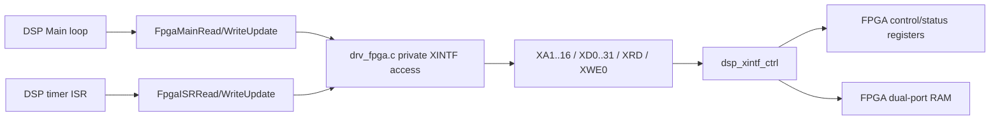

# ARCHITECTURE.md

> 本文档是本工程的**架构地图与设计准则**。目标是让维护人员或 Codex 用较少上下文快速建立正确的系统模型，而不是替代源码。

## 1. 文档定位

`ARCHITECTURE.md` 重点回答：

- 系统由哪些主要子系统组成，各自负责什么；
- 子系统之间如何依赖、调用和传递数据；
- 关键初始化顺序、运行期流程和生命周期是什么；
- 哪些设计约束、硬件约束和设计意图不能被随意破坏；
- 修改某类功能时，应优先查看哪些模块和文件。

**源码是当前实现的最终事实来源。** Architecture 用于导航和记录跨模块设计信息；修改模块前仍应阅读对应 `.c/.h`。

若文档与代码冲突，应先确认当前实现和 Git 历史，再修正文档或代码，不要仅凭文档修改已验证实现。

## 2. 内容取舍原则

### 应优先记录

- 子系统职责和责任边界；
- Driver / Service / Application / Task 等分层关系；
- 跨文件的数据流、控制流和调用方向；
- 上电初始化、运行期处理、保存/恢复、Boot/APP 跳转等关键流程；
- ISR、主循环、后台任务之间的职责划分；
- 重要地址、共享数据、协议区等资源布局；
- 实时性、阻塞、watchdog、兼容性等关键约束；
- 已确认的设计意图，例如某初始化顺序为什么不能交换；
- 增加同类功能时应沿用的扩展路径。

### 通常不要记录

- 每个函数的参数、返回值和逐函数说明；
- 结构体完整字段、宏、错误码、寄存器值的简单抄录；
- 驱动内部逐步骤寄存器操作；
- 源码逐行翻译或大段代码复制；
- 打开 1～2 个明确源码文件即可快速得到的局部实现细节。

**判断原则：Architecture 记录“跨文件关系、设计意图和约束”，局部实现留在源码。**

## 3. 粒度

- 一个普通子系统通常控制在 **30～100 行**；复杂子系统只保留高层摘要。
- 整个文件优先保持在几百行量级，避免演变成几千行的源码说明书。
- 若某模块需要大量协议、状态机、算法或调试细节，拆到 `docs/<subsystem>.md`，这里只保留摘要和入口。
- 优先使用简短文字、表格、ASCII/Mermaid 图表达跨模块关系。

## 4. 子系统章节建议结构

按实际需要选用，不要求每项都写：

1. **职责**：解决什么问题，责任边界是什么。
2. **分层与核心文件**：关键模块/文件各自在架构中的角色。
3. **关键数据流 / 控制流**：重点描述跨模块关系。
4. **生命周期 / 时序**：上电、运行、更新、保存、恢复等关键顺序。
5. **关键约束与设计意图**：不可随意破坏的规则及其原因。
6. **扩展规则**：新增同类功能时应从哪一层扩展。

## 5. Codex / Agent 更新规则

当根据已有代码补充或更新本文件时：

1. 先阅读本文件，再阅读目标子系统的核心 `.c/.h`；需要确认跨模块关系时再沿调用链读取关联文件。
2. 目标是**反向提炼当前已存在的架构**，不是借整理文档重新设计或重构代码。
3. 用户明确说明已经实机验证、当前实现正确的模块，整理文档时不要修改源码。
4. 优先写职责、分层、数据流、生命周期、关键约束和设计意图；避免逐函数流水账。
5. 无法从代码或已有信息确认的设计意图不要猜测，标记为“待确认”。
6. 完成后重新对照相关源码，确认文档与当前实现一致。
7. 内容过细时拆到 `docs/`，不要持续膨胀本文件。

## 6. 工程架构

后续逐步补充已经稳定或需要长期维护的子系统，例如：

- System Startup / Main Loop
- Interrupt & Real-time Control
- EEPROM Parameter Storage
- Boot / APP Handoff
- Communication
- FPGA Interface
- ADC / Sampling / Control Data Path

## 7. EEPROM Parameter Storage 与 Boot / APP Handoff

### 7.1 职责与分层

EEPROM 子系统同时服务于 APP 业务参数持久化，以及 APP 与 Boot 之间的启动信息交接。分层关系如下：

| 层级 | APP 工程 | Boot 工程 | 职责 |
| --- | --- | --- | --- |
| I2C Driver | `drv_Eeprom.c/.h` | `APP/Comm/drv_Eeprom.c/.h` | 以 EEPROM byte 为单位完成底层 I2C 读写，并上报总线忙、NACK 等错误 |
| Storage Service | `app_eeprom_config.c/.h`、`app_boot_eeprom.c/.h` | `task_boot_eeprom.c/.h` | C28x word 与 EEPROM byte 转换；管理块格式、默认值、版本、首尾标记和校验和 |
| Application / Task | `task_eeprom_param.c/.h` | `task_eeprom_download.c/.h` | 在持久化结构与运行期 Modbus 数据之间同步；控制下载标志以及 Boot/APP 跳转 |
| Startup Integration | `drv_GlobalVar.c`、`Main.c` | `drv_GlobalVar.c`、`Main.c` | 保证 I2C、EEPROM 参数、网络和主循环的初始化/处理顺序 |

底层驱动不理解业务结构；块格式和校验属于 Storage Service；命令识别、运行期变量同步和跳转决策属于 Task/Application。新增参数时应沿此边界扩展，不应让底层 I2C 驱动依赖 Modbus 或 Boot 业务。

### 7.2 EEPROM 布局与共享协议

| 区域 | 起始 EEPROM byte 地址 | 使用方 | 作用 |
| --- | ---: | --- | --- |
| Boot 共享参数块 | `0x0000` | APP + Boot | 保存网络 IP 和下载标志，作为两个固件之间的持久化交接区 |
| APP 配置块 | `0x0100` | APP | 保存保护参数、系数使能和 28 组 K/B 校准系数 |

C28x 中本工程按 `Uint16` word 管理结构体；落盘时每个 word 拆成两个 EEPROM byte，固定为低字节在前。APP 配置块通过固定 512-word raw payload 保持存储占用和布局稳定，并按最多 64 word（128 byte）分段读写。

两个块都采用“固定标记 + 版本 + payload + 尾标记 + 累加校验”的自描述格式。Boot 共享块在 APP 与 Boot 中有各自的类型声明，但其字段顺序、常量、字节序和校验范围必须完全一致；它们共同构成跨固件持久化 ABI。

### 7.3 生命周期与数据流

APP 上电流程：

1. `Main.c` 先初始化 I2C GPIO 和 I2C 外设，再进入用户参数初始化。
2. `InitUserPara()` 先初始化运行期数据，再调用 `EepromParam_Init()`。
3. 共享块和 APP 配置块分别读取、校验；读取或校验失败时使用默认值。共享块校验失败时会重建格式并写回，APP 配置块当前只加载默认值。
4. `task_eeprom_param.c` 将 IP、保护参数和校准系数同步到 Modbus 运行期结构。
5. EEPROM 初始化必须早于 `Init_W5500()`，因为 W5500 网络初始化依赖持久化 IP。

APP 运行期流程：

- 主循环调用 `EepromParam_Process()` 处理参数保存命令。
- IP 更新写入 Boot 共享块；保护/系数更新先从运行期结构同步到 APP 配置块，校验 K 系数范围后再整块保存。
- APP 请求进入 Boot 时，先把共享块下载标志置为 `11` 并保存，再跳转到 Boot 入口 `0x33FFF6`。

Boot 上电与返回 APP 流程：

1. Boot 完成 I2C 初始化后，`InitEeromPara_Downloads()` 只初始化一次共享参数块，并把其中 IP 同步给 Boot 网络栈。
2. Boot 同时检查下载标志和 APP 起始地址 `0x320000` 的内容：下载标志不是 `11` 且 APP 非空时直接跳转 APP；否则留在 Boot 等待升级。
3. 升级完成或收到跳转 APP 命令时，Boot 将下载标志清零并写回 EEPROM，然后关闭网络 socket 并跳转 APP。

### 7.4 关键约束与扩展规则

- **共享格式兼容性：** 修改 Boot 共享结构、magic、version、地址、字节序或校验范围时，必须同步修改 APP 和 Boot；不兼容修改应升级版本并明确迁移策略。
- **地址隔离：** Boot 共享块与 APP 配置块不得重叠；新增持久化区域前应按实际 EEPROM byte 占用重新核算边界。
- **初始化顺序：** 必须先初始化 I2C，再读取 EEPROM；必须先将 EEPROM IP 同步到运行期变量，再初始化 W5500。
- **上下文限制：** 当前 EEPROM I2C 驱动使用阻塞轮询，不应从 ISR 或实时控制路径调用。轮询当前没有超时恢复，I2C 外设或总线异常可能造成长期阻塞。
- **Watchdog：** EEPROM 多页写入和下载标志写入可能超过看门狗周期，当前 APP/Boot 在这些保存路径外使用 `DisableDog()` / `EnableWDog()` 包裹。新增耗时写路径必须沿用该约束，并保证所有返回路径最终恢复看门狗。
- **失败语义：** 读取、格式校验与写入状态应继续向上层传播；运行期数据不能在未校验的 EEPROM 内容上建立。
- **参数扩展：** APP 业务参数优先增加到 `APP_EEPROM_USER_DATA` 或其保留区，并保持不超过固定 raw payload；改变持久化解释时应升级配置版本。Boot 不读取 APP 专用配置块。

## 8. DSP 与 FPGA XINTF 通信

### 8.1 职责与边界

XINTF 通信用于 `MCU_2833x_APP_demo` 与 `fpga_proj_v3_app` 之间的 32-bit 寄存器和 RAM 交换。DSP 为 XINTF 总线主机，FPGA 根据地址和读写选通控制寄存器或片内 RAM。

| 层级 | 核心文件 | 职责 |
| --- | --- | --- |
| DSP Application | `APP/Main.c`、`APP/Interrupt.c` | 分别在主循环和定时 ISR 中触发数据刷新，不直接访问 XINTF 地址 |
| DSP FPGA Driver | `APP/Comm/drv_fpga.c/.h` | 维护 Main/ISR 上下行数据镜像，封装物理基址、寄存器地址和 `volatile` 读写 |
| DSP XINTF HAL | `DSP_common/DSP2833x_Xintf.c/.h` | 配置 XINTF Zone 6 时序、总线宽度和 XINTF GPIO |
| FPGA Bus Bridge | `fpga_proj_v3_app/rtl/dsp_xintf_ctrl.v` | 同步 DSP 读写控制，生成写脉冲，控制读数据三态输出，并在寄存器与 RAM 间分流 |
| FPGA Integration | `fpga_proj_v3_app/rtl/top.v`、`al_ip/PLL_0`、`al_ip/XINTF_RAM_DSP_WR_0`、`al_ip/XINTF_RAM_DSP_RD_0`、`constrain/io.adc` | 连接顶层管脚、100 MHz PLL、两块 512×32 双口 RAM 和临时验证逻辑 |

`fpga_proj_v3_boot` 使用另一套 DSP 通信接口，当前不属于本节所述 APP XINTF 协议；若后续需要兼容，应单独核对其地址和时序。

### 8.2 物理接口与初始化

- DSP 驱动以 XINTF Zone 6 基地址 `0x100000` 访问 FPGA，数据类型为 `Uint32`。物理数据总线为 XD0–XD31。
- FPGA 顶层引入 XA1–XA16，形成 16-bit 逻辑地址。C28x 以 16-bit word 寻址，`Uint32 *` 递增会跨过两个 word；在 XA0 未连入 FPGA 的前提下，驱动的 `Uint32` 偏移与 FPGA 逻辑地址对应。
- 写选通使用 XWE0，读选通预期使用 XRD。FPGA 顶层没有 XREADY、XRNW 或 Zone chip-select 输入，因此当前协议完全依赖固定读写时序和 XRD/XWE0。
- `Main.c` 先调用 `InitXintf()`，再进入 `InitUserPara()`。`InitXintf()` 配置 Zone 6 读写 lead/active/trail 为 3/7/3，不使用 XREADY，关闭写缓冲，并初始化 XD0–XD31、XA0–XA16 和 XWE0 的复用。GPIO80–GPIO87 对应 XA8–XA15，GPIO39 对应 XA16；GPIO39 不是 XRD。
- `FpgaDrvInit()` 只清零 DSP 侧的通信数据镜像，不配置 XINTF 外设；不得将它与 `InitXintf()` 的职责混合。

### 8.3 运行期数据流

- 主循环每轮先调用 `FpgaMainReadUpdate()`，在网络、EEPROM 和版本处理后调用 `FpgaMainWriteUpdate()`。
- 定时 ISR 先调用 `FpgaISRReadUpdate()`，执行 ADC/示波器处理后调用 `FpgaISRWriteUpdate()`。Main 与 ISR 的地址区域必须隔离，避免实时数据与后台配置互相覆盖。
- `drv_fpga.h` 只对外暴露数据结构、数据镜像、四个寄存器刷新接口和带边界检查的 `FpgaRamRead/Write()`。`FPGA_BASE_ADDR`、`DataW`、`DataR` 和实际地址定义必须留在 `drv_fpga.c` 内，其他模块不得绕过驱动直接访问 FPGA。
- FPGA 将 XRD/XWE0 各经两级触发器同步到 100 MHz 域。写通路在同步后的 XWE0 上升沿生成单周期脉冲；读通路仅在同步后的 XRD 有效期间驱动双向数据总线，其余时间为高阻。

### 8.4 地址空间与当前实现状态

同一逻辑地址的读、写方向可以对应不同寄存器。以下表格同时区分软件规划与 FPGA 已实现逻辑：

| DSP 逻辑地址 | 规划用途 | DSP 侧当前使用 | FPGA 侧当前状态 |
| ---: | --- | --- | --- |
| `0` | Main 寄存器区起点 | 写 `ctrl_reg`；读 `fpga_info` | 已译码；临时验证逻辑将 DSP 写入值的低 16 位与固定签名组合后回读 |
| `1–49` | Main 保留寄存器 | 未使用 | 未译码 |
| `50` | ISR 寄存器区起点 | 写 `current_setpoint`；读 `sample_done_flag` | 未译码；当前读返回 0，写入被忽略 |
| `51–99` | ISR 保留寄存器 | 未使用 | 未译码 |
| `100–199` | 保留，不得分配给 Main/ISR | 未使用 | 未译码 |
| `200–711` | FPGA RAM 窗口 | `FpgaRamRead/Write(offset)`，`offset` 为 0–511 | 已译码为两块独立 512×32 RAM 的地址 0–511；相同逻辑地址按读写方向进入不同 RAM |

RAM 使用两块物理独立的 512×32 双口 RAM：DSP 写操作进入 `XINTF_RAM_DSP_WR_0`，DSP 读操作来自 `XINTF_RAM_DSP_RD_0`。FPGA 业务侧分别使用另一端口消费写 RAM、生产读 RAM；两种方向共享 DSP 逻辑地址 200–711，但不会互相覆盖。

### 8.5 时序、CDC 与总线所有权

- DSP 写周期内由 DSP 驱动 XD0–XD31；FPGA 只在读选通有效期间驱动该总线。新增逻辑不得在写周期或空闲期驱动总线，否则会造成硬件冲突。
- FPGA 当前只同步了 XRD/XWE0，没有同步或锁存地址与数据。因此正确采样依赖 DSP 的 lead/active/trail 窗口覆盖两级同步和后续处理延迟。修改 DSP XINTF 时序或 FPGA 系统时钟时，必须重新做时序仿真和实机测试。
- XREADY 当前未使用，总线不能因 FPGA 或 RAM 尚未就绪而伸长 DSP 周期。两块 ERAM 均为同步双口 RAM，其读延迟由当前固定 XINTF 时序和 100 MHz FPGA 时钟吸收。
- `constrain/timing.sdc` 当前只定义外部晶振及 PLL 派生时钟，没有对异步 XINTF 输入/输出建立完整约束。CDC 标记只能保护控制信号同步器，不等价于整个异步总线已满足时序。

2026-08-17 已完成一次实机 RAM/SRAM-only 验证：FPGA 使用 100 MHz 时钟和两块独立 ERAM；DSP 完成地址 0 寄存器回显以及地址 200–711 的 512 个 32-bit 模式写入、FPGA 搬运和回读比较，结果为 `state=5, pass=1, error=0, index=512`。该结果验证当前板卡和固定时序组合，但不替代外部接口时序约束或跨温压裕量测试。

### 8.6 已知缺口与完成条件

当前仍需闭环的事项：

1. FPGA 正式寄存器译码仍只有地址 0；ISR 地址 50 及后续 Main/ISR 字段尚未实现。新增字段时必须同步修改 DSP 地址定义、FPGA `case` 译码和本文档地址表。
2. 当前地址 0 回显和两块 RAM 之间的数据搬运位于临时 `xintf_validation_test` 中。验证结束后接入正式业务逻辑时，必须保留相同地址 ABI，并重新执行完整实机测试。
3. FPGA 顶层未引入 Zone chip-select，任何满足地址和 XRD/XWE0 条件的 Zone 6 周期都会被响应；若总线上增加其他器件，应补入片选并重新核对总线所有权。
4. XINTF 外部输入/输出延迟尚未写入 SDC。当前 100 MHz 内部时序收敛和单板实测通过，不能证明异步板级接口具有完整 PVT 裕量。

正式业务逻辑完成时，验证至少应包含：DSP 全量编译；FPGA lint/综合/时序检查；寄存器地址 0 和 50 的双向读写仿真；RAM 起始、分区边界和最后地址测试；连续读写、Main/ISR 交错以及复位中断测试；最后再用逻辑分析仪核对 XRD/XWE0、地址、数据与 FPGA 100 MHz 采样关系。

### 8.7 扩展规则

- Main 寄存器只能分配在 `[0, 50)`，ISR 寄存器只能分配在 `[50, 100)`；`[100, 200)` 保留，RAM 使用经确认后的独立窗口。
- 寄存器地址是 DSP/FPGA 跨芯片 ABI。任何新增、移动、改宽或改变读写方向都必须成对更新 DSP 驱动和 FPGA 译码，不得只修改一侧。
- Main/ISR 代码只能通过四个 `Fpga*Update()` 接口交换寄存器数据。RAM 后续应建立独立、有边界检查的块读写接口，不得向业务层重新暴露 `DataW/DataR`。
- ISR 刷新必须保持固定且可界定的执行时间；不得在 ISR 中执行可变长度 RAM 传输、轮询等待或带重试的访问。
- 如果引入 XREADY、片选、更宽地址总线或异步 FIFO，应先固化物理连接和时序协议，再扩展寄存器与 RAM 映射。
